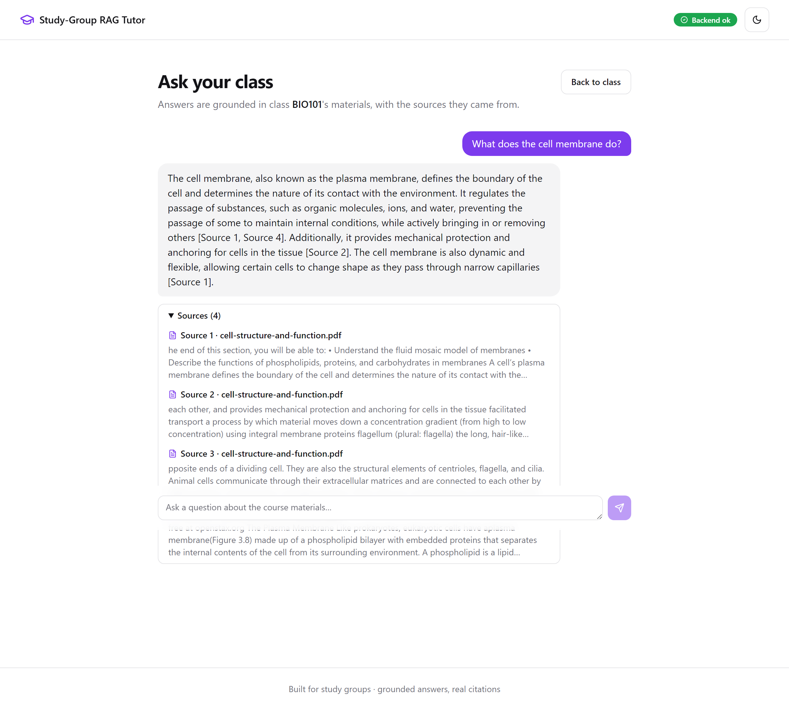
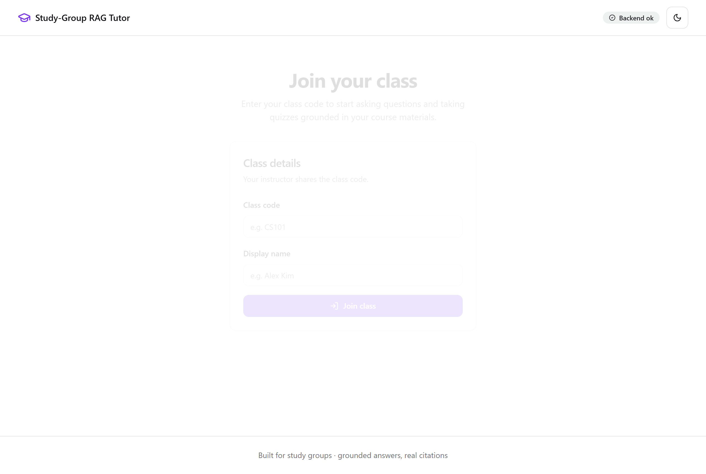
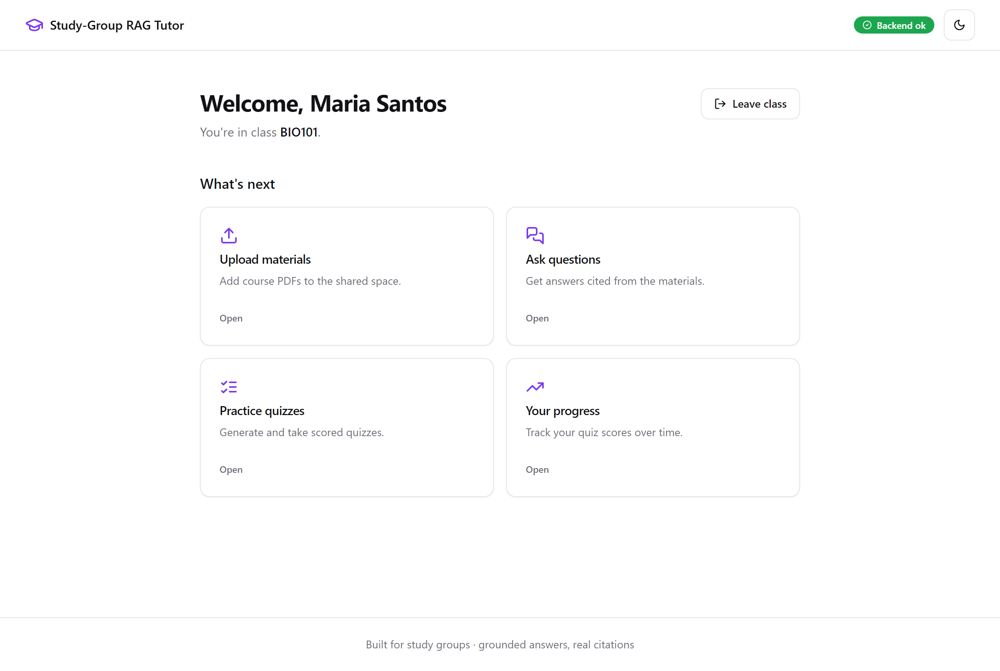
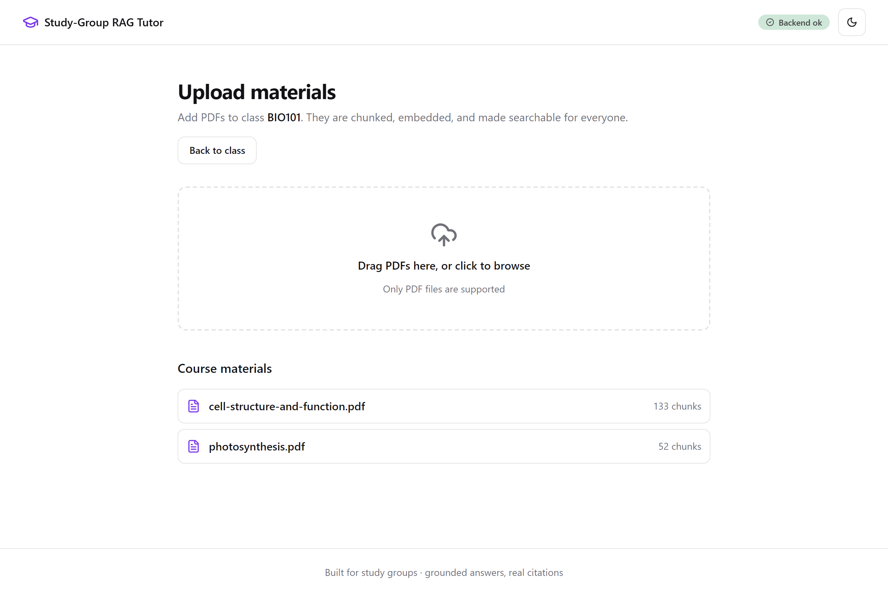
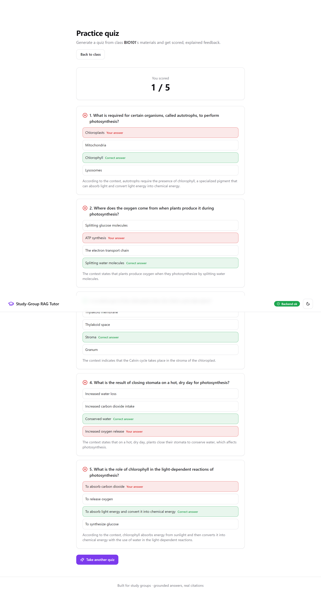
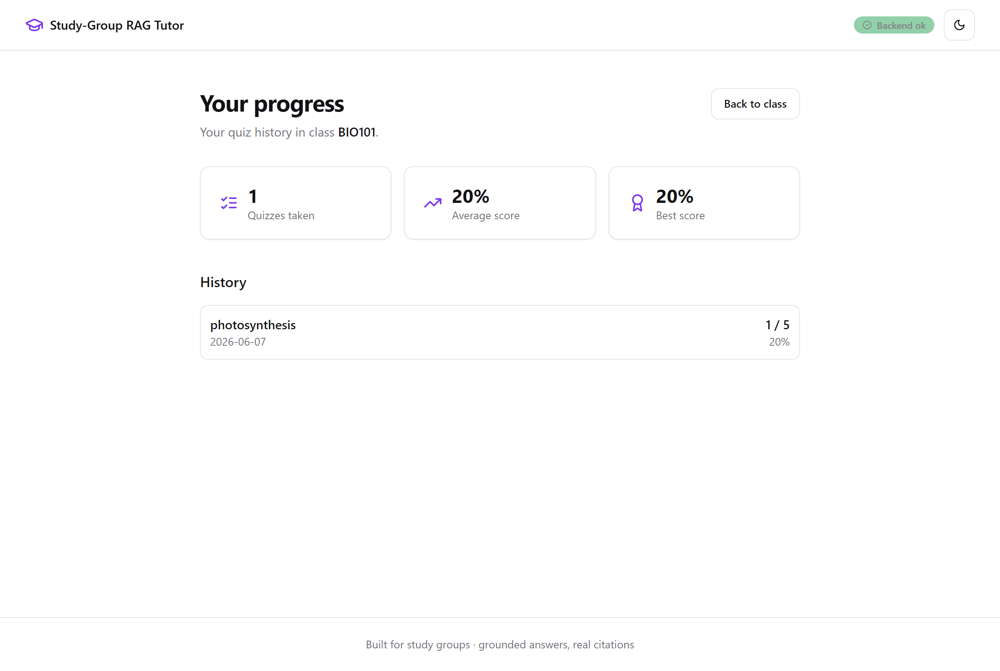

# 📚 Study-Group RAG Tutor

> A shared, course-scoped study assistant for a whole class: upload the materials
> once, then ask questions and get **answers grounded in those materials with
> citations** — and generate **scored practice quizzes** from the same content.

[](https://github.com/abinthomas9322/study-rag-tutor/actions/workflows/ci.yml)
[](https://github.com/abinthomas9322/study-rag-tutor/actions/workflows/codeql.yml)
[](backend/pyproject.toml)
[](backend/)
[](frontend/)
[](backend/app/main.py)
[](frontend/src/)
[](LICENSE)

---

## What it does

A class of students joins one shared **course space**. Anyone uploads the course
PDFs once; they're chunked, embedded, and indexed into a per-course vector store.
From then on, every student can:

- **Ask questions** → get an answer written **only** from the course materials,
  with the exact source passages cited. Nothing in the materials? It says so,
  instead of guessing.
- **Generate quizzes** → multiple-choice questions drawn from the same content,
  scored server-side with per-question explanations.

> **Ask** _"What does the cell membrane do?"_ → **get** a grounded paragraph
> ending in `[Source 1, Source 4]`, with those passages shown beneath it, pulled
> from the actual uploaded chapter.

## Live demo

Not deployed yet — it runs locally (see [Quick start](#quick-start)). A free
hosted deployment is tracked as Phase 9 in the [roadmap](docs/ROADMAP.md).

## Cost

**Runs effectively free.** Embeddings are computed locally with a small ONNX
model (no API, no GPU), so the only external call is text generation via Groq,
which has a free tier. No paid infrastructure is required to run it.

## Hero demo

A real grounded answer with its citations, captured from the production build
running on real [OpenStax](https://openstax.org) biology content:



## Deep-dive docs

- 🏛️ [Architecture & diagrams](docs/ARCHITECTURE.md) — system, data-flow, sequence, ER
- 📝 [Build journal](docs/JOURNAL.md) — the plain-English build story
- 🔬 [Technical report](docs/TECHNICAL_REPORT.md) — design decisions and measured results
- 🗺️ [Roadmap](docs/ROADMAP.md) — slices, progress, and what's next

## Quick start

> Prerequisites: Python 3.12, Node 22, and a free [Groq API key](https://console.groq.com).

### 1. Backend (FastAPI)

```bash
# from the repo root
python -m venv .venv
source .venv/bin/activate            # Windows: .venv\Scripts\activate
pip install -r backend/requirements.txt -r backend/requirements-dev.txt

cp .env.example backend/.env         # then put your GROQ_API_KEY in backend/.env

cd backend
python -m seed.seed_demo             # optional: load the real OpenStax demo course
uvicorn app.main:create_app --factory --port 8000
```

### 2. Frontend (Vite + React)

```bash
cd frontend
npm ci
npm run dev                          # http://localhost:5173 (proxies /api -> :8000)
```

Open <http://localhost:5173>, join class **BIO101** (if you ran the seed), and ask away.

### 3. Quality gates

```bash
# backend (from backend/)
pytest                 # tests + 100% coverage gate
ruff check . && ruff format --check .
mypy rag app
bandit -r rag app

# frontend (from frontend/)
npm run lint && npm run typecheck && npm run test:run && npm run build
```

## CI/CD pipeline

Two GitHub Actions workflows run on every push and pull request, with
least-privilege permissions and concurrency-cancel:

- **`ci.yml`**
  - **Secret scan** — gitleaks
  - **Filesystem/dependency CVEs** — Trivy (fails on CRITICAL/HIGH, fixable)
  - **Python job** — ruff lint, ruff format check, mypy, bandit, pip-audit, pytest (+100% coverage)
  - **Frontend job** — eslint, prettier check, tsc, vitest, production build, npm audit
- **`codeql.yml`** — CodeQL SAST for **Python** and **JavaScript/TypeScript**, plus a weekly scheduled scan.

Dependency versions are pinned (pip requirements + npm lockfile); `npm audit`
reports zero vulnerabilities.

## Features

- 🔐 **Course spaces** — create/join a class by code; retrieval is strictly scoped per course, so one class never sees another's material.
- 📄 **PDF ingestion** — upload PDFs that are extracted, chunked, embedded, and indexed; non-PDFs are rejected with a clear message.
- 💬 **Grounded Q&A** — answers cite their sources and admit when the answer isn't in the materials (no hallucination).
- 🧪 **Quiz tutor** — generate topic-focused or broad MCQ quizzes; answer key is withheld until you submit, then you get a score plus per-question explanations.
- 📈 **Per-student progress** — every attempt is stored; the progress screen shows quizzes taken, average, best, and a dated history.
- 🎨 **World-class UI** — responsive, accessible (WCAG-minded, automated axe checks), light/dark themed, with loading/empty/error states everywhere.

## Architecture

A FastAPI backend (`backend/app`) over a pure RAG core (`backend/rag`), with a
Vite + React SPA (`frontend/src`). One SQLite file holds **both** the relational
data and the vectors — the vector store is **sqlite-vec** (chosen over ChromaDB
to resolve a critical CVE), and embeddings come from **fastembed** (ONNX,
CPU-only, no PyTorch — deliberately light on memory). See the full
[diagrams](docs/ARCHITECTURE.md).

**HTTP API** (`backend/app/routes.py`):

| Method | Route | Purpose |
|--------|-------|---------|
| GET  | `/health` | Liveness probe |
| POST | `/courses` · GET `/courses` · GET `/courses/{id}` | Course CRUD |
| POST | `/courses/{id}/join` · GET `/courses/{id}/students` | Join / list students |
| POST | `/courses/{id}/documents` · GET `/courses/{id}/documents` | Upload / list materials |
| POST | `/courses/{id}/ask` | Grounded, cited answer |
| POST | `/courses/{id}/quiz` | Generate a quiz (answer key withheld) |
| POST | `/courses/{id}/quizzes/{quiz_id}/attempts` | Score & store an attempt |
| GET  | `/courses/{id}/students/{sid}/attempts` | A student's quiz history |

## Screenshots

All captured from the **production build** running on real OpenStax content
(see [`frontend/scripts/screenshots.mjs`](frontend/scripts/screenshots.mjs)).

| Join a class | Course home |
|---|---|
|  |  |

| Upload materials | Ask (grounded + cited) |
|---|---|
|  |  |

| Quiz results & review | Your progress |
|---|---|
|  |  |

## Approach & decisions

The core is a classic **retrieval-augmented generation** loop, kept honest:

1. **Ingest** — `pdf.extract_text` → `chunking.chunk_text` (character windows with
   overlap) → `embeddings.Embedder` (fastembed `all-MiniLM-L6-v2`) →
   `store.VectorStore.add` (text in a `chunks` table, vectors in a `vec_chunks`
   `sqlite-vec` table, partitioned by course).
2. **Retrieve** — embed the question, run a course-scoped similarity search for
   the top-k chunks.
3. **Generate** — the LLM (Groq `llama-3.3-70b-versatile`) is instructed to answer
   **only** from the retrieved context and to cite `[Source N]`. If retrieval is
   empty, the LLM is never called — the app returns an honest "I don't know".

Quizzes reuse the same retrieval, then ask the model (in JSON mode) for
structured questions; the answer key is persisted server-side so it never reaches
the browser until an attempt is scored. More detail in the
[technical report](docs/TECHNICAL_REPORT.md).

## Productionizing & scaling

✍️ _TODO: my words_

## Key technical decisions & why

✍️ _TODO: my words_

## Engineering standards I followed (and skipped)

✍️ _TODO: my words_

## How I used AI tools in development

✍️ _TODO: my words_

## What I'd do differently with more time

✍️ _TODO: my words_

## Edge cases knowingly skipped

✍️ _TODO: my words_

## License

[MIT](LICENSE) © 2026 Abin Oommen Thomas

## About / Topics

A portfolio-grade, course-scoped RAG study assistant: shared class spaces,
cited answers, and auto-generated quizzes — FastAPI · React · sqlite-vec ·
fastembed · Groq.

**Topics:** `rag` · `retrieval-augmented-generation` · `fastapi` · `react` ·
`typescript` · `sqlite-vec` · `fastembed` · `groq` · `llm` · `education` ·
`vector-search` · `portfolio`
