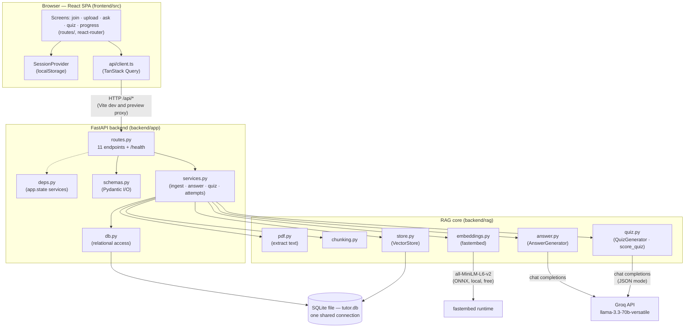
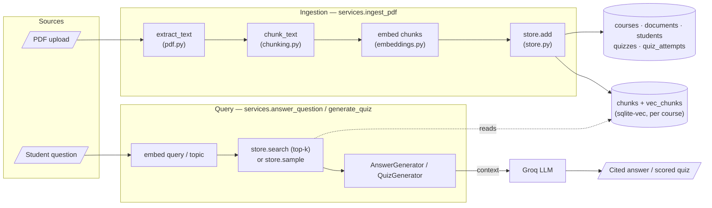
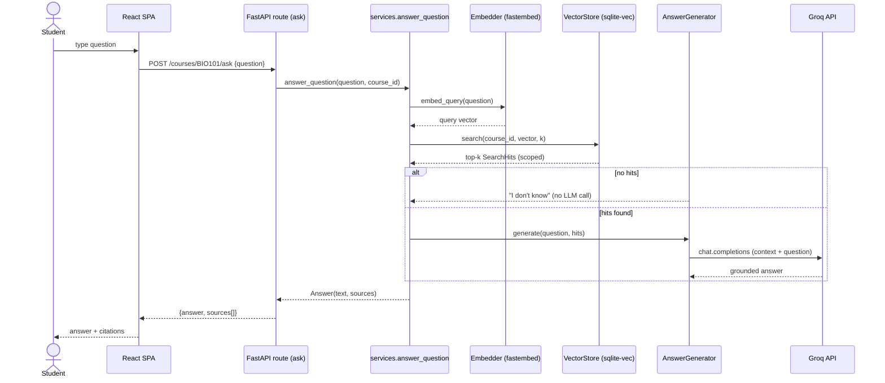
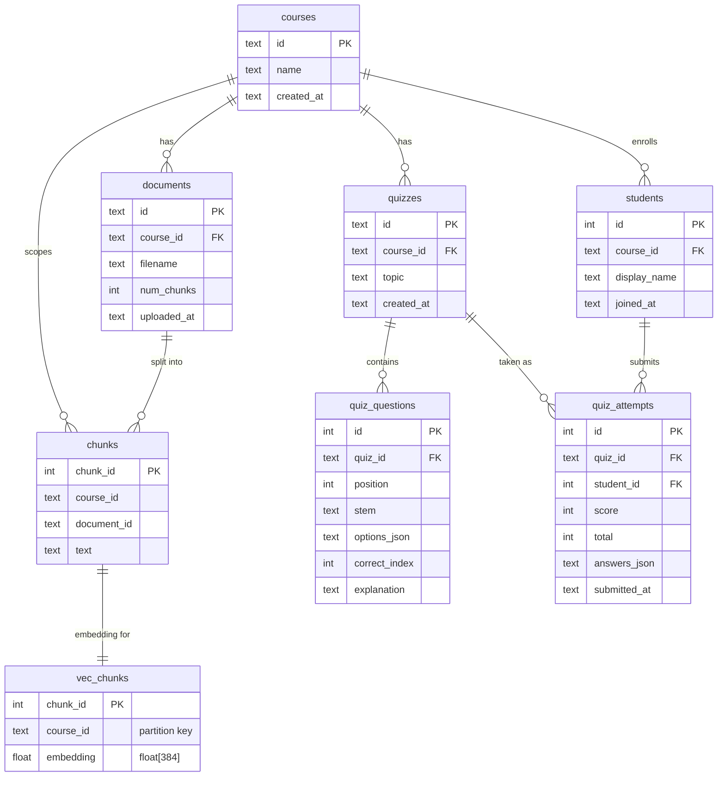

# 🏛️ Architecture — Study-Group RAG Tutor

These diagrams are derived directly from the code; every node maps to a real
module, route, or table. They are written in [Mermaid](https://mermaid.js.org/)
so they render natively on GitHub.

- **Backend** — `backend/app` (FastAPI HTTP layer) + `backend/rag` (the pure RAG
  core). One SQLite file holds both the relational data (`app/db.py`) and the
  vectors (`rag/store.py`, via the `sqlite-vec` extension), shared through a
  single connection.
- **Frontend** — `frontend/src`, a Vite + React SPA that calls the backend under
  `/api` (proxied to the FastAPI server in dev and in the production preview).

---

## 1. System architecture

How the components connect. The browser only ever talks to the backend over
`/api`; embeddings run locally (fastembed/ONNX) while only answer/quiz
generation calls out to Groq.

---

## 2. Data-flow diagram (DFD)

Two flows share the same vector store. **Ingestion** turns an uploaded PDF into
indexed chunks; **querying** turns a question into a grounded, cited answer.

---

## 3. Sequence — a grounded `/ask` request

The lifecycle of `POST /courses/{id}/ask`. Retrieval is scoped to the course;
if nothing is retrieved the LLM is never called (an honest "I don't know").

---

## 4. Entity-relationship diagram (ER)

The SQLite schema. `courses`/`students`/`documents`/`quizzes`/`quiz_questions`/
`quiz_attempts` live in `app/db.py`; `chunks` and the `vec_chunks` vector table
live in `rag/store.py`. All relational children cascade-delete from `courses`.

